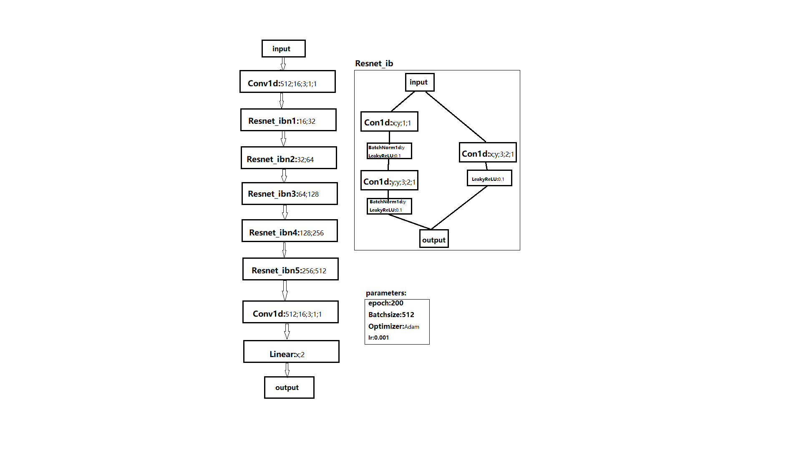

Parkinson
======
# Introduction<br>
Prediction of Parkson disease by speech recognition based on pytorch<br>

Algorithm design based on GAN principle [Parkinson2](https://github.com/Jaker926/Parkinson2)<br>

# Installation
```
python==3.8
torch>=1.6
```
# Data preparation
You can get the [data](https://www.heywhale.com/mw/dataset/5eaa823c366f4d002d73a697/file)
# Training
```
python *_train.py
```

# Results

```
python yyr_test1.py
```
## table_1
|| prediction | F1 | MCC | 
| :--- | :---: | :---: | :---: |
|Concat| 69.04 | 64.99 | 0.3379 |
|TQWT| 80.78 | 76.24 | 0.5683 |
|MFCC| 82.5 | 88.6 | 0.513 |
|Wavelet| 75 | 85.1 | 0.161 |

## table_2
|| prediction | recall | F1 | MCC | 
| :--- | :---: | :---: | :---: | :---: |
|Concat_Wavelet| 67.92 | 65.49 | 66.68 | 0.3333 |
|MFCC_Concat| 69.19 | 67.06 | 68.11 | 0.3618 |
|MFCC_Wavelet| 64.47 | 61.58 | 62.99 | 0.2589 |
|TQWT_Concat| 79.56 | 75.18 | 77.31 | 0.5457 |
|TQWT_MFCC| 88.36 | 81.22 | 84.64 | 0.6921 |
|TQWT_Wavelet| 77.8 | 75.68 | 76.73 | 0.5344 |

## table_3
|| prediction | recall | F1 | MCC | 
| :--- | :---: | :---: | :---: | :---: |
|TQWT_MFCC_Wavelet| 75.87 | 72.04 | 73.91 | 0.4776 |
|TQWT_MFCC_Concat| 84.9 | 78.85 | 81.76 | 0.6347 |
|TQWT_Wavelet_Concat| 80.07 | 77.78 | 78.91 | 0.5780 |
|MFCC_Wavelet_Concat| 68.44 | 65.24 | 66.8 | 0.3353 |

